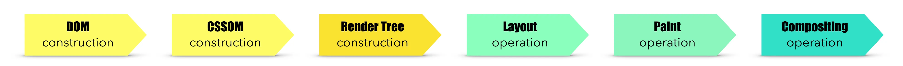

1. How would you resolve a situation where two clients are trying to update the same resource at the same time
  * Locking
  * Versioning
  * Merge Changes
  * Notify users of conflict

2. Explain how a browser renders a webpage (CRP)
  

3. At what stage are inline styles parsed
  * Inline styles are parsed by the browser's rendering engine during the rendring stage, after the HTML and the CSS files are been loaded and parsed.

4. Repaint vs reflow
  * 
  
- How to make a web page load faster
- How does keep connection alive header help web pages load faster
- How to implement caching
- How to implement infinite scrolling
- What do webpack and babel do
- What is treeshaking
- Explain CSS box model
- What does SASS do
- When to use a CSS framework vs write from scratch
- What is mobile first web design
- What is the difference between responsive and fluid
- What is Tachyon
- What is a problem wrapping multiple async operations in Promise.all
- What is the CORS error, why does it exist and how can you address it
- What is the difference between a Put and Patch request
- What is GraphQL and what are its advantages?
- Functional vs OOP approach in React (HOCs vs Class extension)
- What are React hooks
- Explain Node JS event loop
